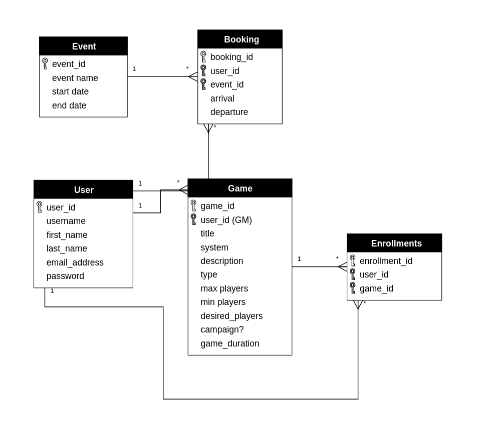

# Callacon
Callacon is a bi-annual gaming convention organised by a group of friends. It has been running for about 20 years, and holds Gaming 'Weekends' twice a year, in Matlock, Derbyshire.  

## Background

Historically, all of the organisation has been undertaken by a single person, but over the last year or so a committee has been formed to spread the workload.  

There are about 50 attendees to each event, and an appropriate number of holiday cottages are booked and paid for centrally through the Gaming Weekend account. Costs are then recovered from attendees.

In addition, games are pitched by GMs, and need to be scheduled and to be able to be signed up for.

This project seeks to provide a bespoke website, giving attendees a one-stop-shop to access all Callacon-related info, and making it easier for the committee to organise the various aspects of the gaming weekend.

We already have [callacon.co.uk](http://www.callacon.co.uk) reserved, so could deploy there if agreed by the committee.

## Scope
There are various functions that this site could perform:
1. Register/amend attendance at the event
2. Calculate cost of that attendance
3. Advertise games that you want to run
4. Sign up for games you'd like to play in
5. Schedule games in available spaces
6. Give attendees ability to see outstanding balances

Once I've listed out all of the user stories I can think of, I'll pull a few together to make an MVP. (Perhaps don't include restricted ability to create an account in MVP.) MVP may include:

- [x] Secure log in/log out
- [x] Ability to register attendance
- [x] Ability to add a game
- [ ] Ability to see all games

## Next steps
Restrict bookings view so that you can only view your own bookings

## Next steps Feb 23
- use existng db to make seed data
- drop existing db
- rename system to game_system
- check pages load okay then push & merge
- new branch to look at testing for bookings & games
- fix existing tests
- look at other steps carried out on testing bookings and games branch & try to work out what to use & what to discard
- set up a pipeline?
 
## Diagrams
Working ERD showing relationship between users, attendance, games and enrollments into games:



## User Stories
### Log in, log out & limiting access

```
As a user
To save my details
I'd like to be able to create an account
```
```
As a user
To protect my privacy
I'd like to be able to sign in/out
```
```
As a committee member
To be able to control who can see the site
I'd like to be able to limit who can create an account
```

### Registering attendance
```
As a user
So that I am guaranteed a room
I'd like to be able to book my attendance
```
```
As a user
If my plans change
I'd like to be able to amend my booking
```
```
As a user
So that I know how much to pay
I'd like my to see the cost of my booking
```

### Organising games
```
As a GM
So that I can advertise for players
I'd like to add my game to the site
```
```
As a GM
So that my campaign can continue
I'd like to be able to add essential players to my game
```
```
As a player
So that I can decide which games I'd like to play in
I'd like to see a list of all available games
```
```
As a player
So that I can enjoy myself
I'd like to be able to register an interest in a game
```

## Game questionnaire fields

| Field | Mandatory?| Field Type | Notes |
| ---- | ---- | ---- | ---- |
| GM name | Yes | user_id as FK | name retrieved from users table |
| title | Yes | string |  |
| system | No | string |  |
| description | Yes | text |  |
| min_players | Yes | integer |  |
| max_players | Yes | integer |  |
| pref_when | No | string (initially) | link to scheduler eventually |
| desired_players | No | text (initially) | maybe link to users somehow eventually |
| campaign | Yes | string (initially) | add a campaign table to abstract later |
| game_duration_hours | Yes | numeric (precision = 4, scale = 2) | present on view with 'hours' after it |
